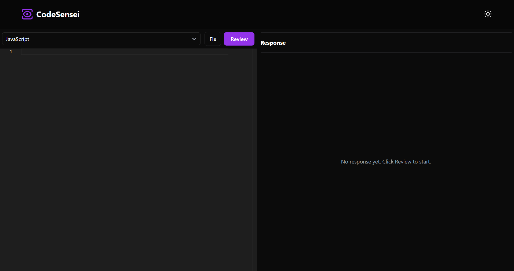
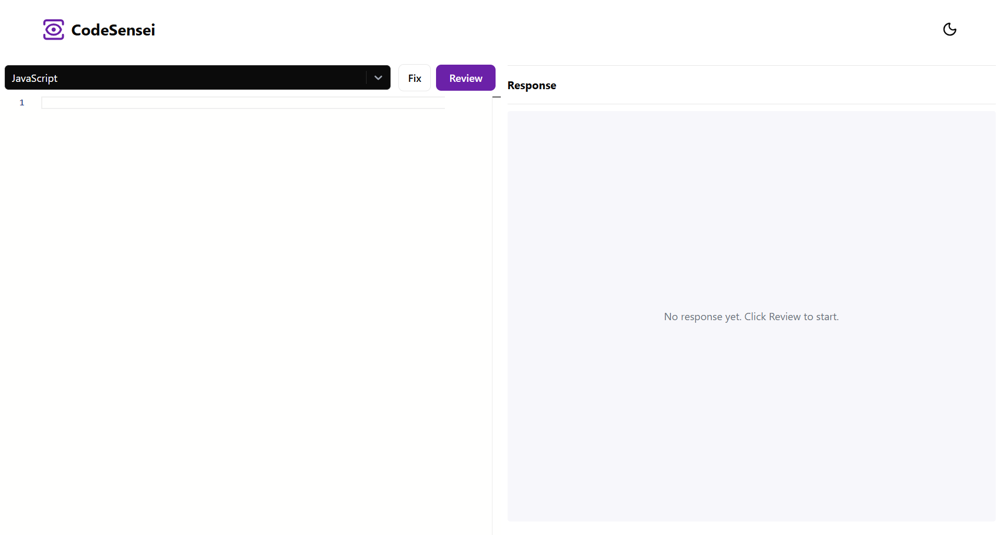
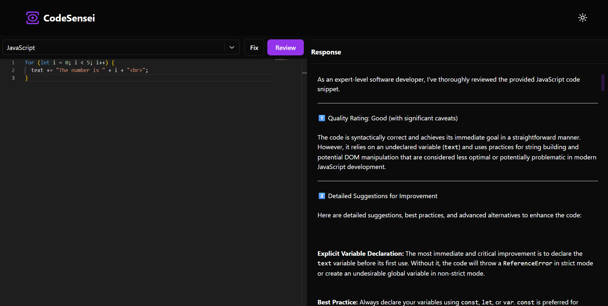
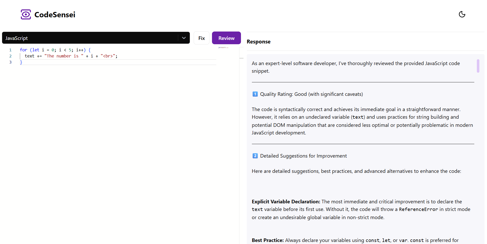

# CodeSensei - AI-Powered Code Review Tool

CodeSensei is a web application that helps developers review and fix their code using Google's Gemini AI. Think of it as having a senior developer look over your shoulder, but it's an AI that never gets tired and works 24/7.

## What Does This App Do?

CodeSensei is like having a personal coding mentor. You paste your code, select the programming language, and it:
- **Reviews your code** - Tells you what's good, what's bad, and what could be better
- **Fixes your code** - Automatically improves your code and fixes common issues
- **Supports 30+ languages** - From JavaScript to Python, Java to Rust, and everything in between
- **Works in dark/light mode** - Because we all have our preferences

##  Screenshots of UI

###  Dark Mode Interface
*Clean, modern dark theme perfect for coding sessions*



###  Light Mode Interface  
*Professional light theme for daytime development*



###  AI Code Review - Dark Mode
*AI-powered code analysis with detailed feedback and suggestions*



###  AI Code Review - Light Mode
*Same powerful AI features in light theme*



## How It Works (The Simple Version)

1. **You write code** - In the left panel (Monaco Editor, same one used in VS Code)
2. **Pick your language** - From the dropdown (JavaScript, Python, etc.)
3. **Click Review** - AI analyzes your code and gives feedback
4. **Click Fix** - AI automatically improves your code
5. **Read the results** - Right panel shows the AI's thoughts and suggestions

## Project Structure (What's What)

```
CodeSensei/
├── src/
│   ├── App.tsx              # Main app - orchestrates all components
│   ├── Components/
│   │   ├── Navbar.tsx       # Top navigation with theme toggle
│   │   ├── LanguageSelector.tsx    # Dropdown for programming languages
│   │   ├── ActionButtons.tsx       # Fix and Review buttons
│   │   ├── CodeEditor.tsx          # Monaco code editor wrapper
│   │   └── ResponsePanel.tsx       # AI response display area
│   ├── hooks/
│   │   └── useCodeActions.ts       # Custom hooks for API calls
│   ├── constants/
│   │   └── languages.ts            # Programming language options
│   ├── helper/
│   │   └── AiHelper.tsx            # Talks to Google's AI
│   ├── enums/
│   │   └── enum.ts                 # Prompts we send to the AI
│   └── assets/                     # Images and icons
├── package.json             # Lists all the tools we need
├── .env                     # Your secret API key (don't share this!)
├── .env-dummy              # Example of what .env should look like
└── README.md               # This file you're reading
```

## Architecture & Component Design

The app follows modern React patterns with clean component separation:

###  **Modular Components**
- **App.tsx** - Main coordinator, handles state and component orchestration
- **LanguageSelector** - Reusable dropdown with custom styling
- **ActionButtons** - Handles Fix/Review actions with loading states
- **CodeEditor** - Monaco editor wrapper with theme support
- **ResponsePanel** - Smart display for AI responses, errors, and loading states

###  **Custom Hooks**
- **useCodeReview** - Manages code review API calls and state
- **useCodeFix** - Handles code fixing logic and markdown parsing
- Separates business logic from UI components

###  **Clean File Organization**
- `/Components` - Reusable UI components
- `/hooks` - Custom React hooks for state management
- `/constants` - Shared data (language options, etc.)
- `/helper` - API integration utilities

###  **Benefits of This Structure**
- **Maintainable** - Each component has a single responsibility
- **Reusable** - Components can be easily used elsewhere
- **Testable** - Isolated logic makes testing easier
- **Scalable** - Easy to add new features without breaking existing code

## Tech Stack (The Nerdy Stuff)

- **React 19** - The main framework (like the engine of a car)
- **TypeScript** - JavaScript but with superpowers (catches errors before they happen)
- **Vite** - Makes everything fast (builds and runs the app quickly)
- **Monaco Editor** - The code editor (same one in VS Code)
- **Tailwind CSS** - Makes it look pretty without writing tons of CSS
- **Google Gemini AI** - The brain that reviews your code

## Installation (Getting It Running)

### Step 1: Get the Code
```bash
git clone [your-repo-url]
cd CodeSensei
```

### Step 2: Install Dependencies
```bash
npm install
```
This downloads all the tools the app needs to work.

### Step 3: Get Your AI Key
1. Go to [Google AI Studio](https://aistudio.google.com/app/apikey)
2. Create a free account
3. Generate an API key (it's free!)
4. Copy that key (keep it secret!)

### Step 4: Set Up Your Environment
1. Copy the `.env-dummy` file and rename it to `.env`
```bash
copy .env-dummy .env
```

2. Open the `.env` file and replace `your_gemini_api_key_here` with your actual API key:
```
VITE_GEMINI_API_KEY=your_actual_api_key_here
```

### Step 5: Start the App
```bash
npm run dev
```
Open your browser and go to `http://localhost:5173`

## How to Use It

### For Code Review:
1. **Paste your code** in the left editor
2. **Select the language** from the dropdown
3. **Click "Review"** button
4. **Read the feedback** in the right panel

The AI will tell you:
- If your code is Better, Good, Normal, or Bad
- What you did well
- What needs improvement
- Any bugs it found
- How to fix issues

### For Code Fixing:
1. **Paste problematic code** in the left editor
2. **Select the language**
3. **Click "Fix"** button
4. **Watch your code get updated** automatically

The AI will:
- Fix syntax errors
- Improve code structure
- Apply best practices
- Make it more readable

## Features You'll Love

###  Dark/Light Theme
Click the sun/moon icon in the top-right to switch themes.

###  30+ Programming Languages
Supports everything from JavaScript to Assembly language.

###  Real-time Feedback
Get instant AI-powered code reviews.

###  Auto-fix
Let AI automatically improve your code.

###  Responsive Design
Works on desktop, tablet, and mobile.

## Common Issues and Solutions

### "API key is missing" error
- Make sure your `.env` file exists
- Check that your API key starts with `VITE_GEMINI_API_KEY=`
- Restart the development server after adding the key

### Code editor not loading
- Clear your browser cache
- Make sure you're using a modern browser (Chrome, Firefox, Safari, Edge)

### AI responses are slow
- This is normal - AI takes time to think
- Free Gemini API has rate limits
- Complex code takes longer to analyze

## Building for Production

When you're ready to deploy:

```bash
npm run build
```

This creates a `dist` folder with all the files ready for hosting.

## Security Note

 **Important**: This app exposes your API key in the browser. For production use, you should:
- Move the AI calls to a backend server
- Never commit your `.env` file to version control
- Consider using server-side API calls instead

## Contributing

Feel free to:
- Report bugs
- Suggest new features
- Submit pull requests
- Improve the documentation

## Component Breakdown

###  **LanguageSelector Component**
- Handles 35+ programming language options
- Custom-styled react-select with dark theme
- Responsive dropdown with proper width management
- Separated constants for easy maintenance

###  **ActionButtons Component**
- Manages Fix and Review button states
- Handles loading indicators and disabled states
- Reusable for any action-based functionality
- Clean separation of UI and logic

###  **CodeEditor Component**
- Wraps Monaco Editor with consistent theming
- Handles code changes and language switching
- Theme synchronization with app-wide settings
- Clean interface for editor functionality

###  **ResponsePanel Component**
- Smart rendering based on app state (loading, error, success)
- Markdown support for formatted AI responses
- Consistent error handling across all states
- Responsive design for different screen sizes

###  **Custom Hooks (useCodeActions)**
- **useCodeReview**: Manages review API calls, loading states, and error handling
- **useCodeFix**: Handles fix operations, markdown parsing, and code extraction
- Separates API logic from UI components
- Reusable across different components

## What Makes This Special

Unlike other code review tools:
- **Free to use** (with Gemini's free tier)
- **No sign-up required** (just need an API key)
- **Works offline** (once loaded)
- **Privacy-first** (your code isn't stored anywhere)
- **Beginner-friendly** (explains everything simply)
- **Well-architected** (clean, maintainable component structure)

## Need Help?

1. Check this README first
2. Look at the `.env-dummy` file for setup examples
3. Make sure your API key is correct
4. Try refreshing the page
5. Check the browser console for errors (F12)

---

**Happy Coding!**

Remember: CodeSensei is a learning tool. Always understand the suggestions before applying them to important projects.
